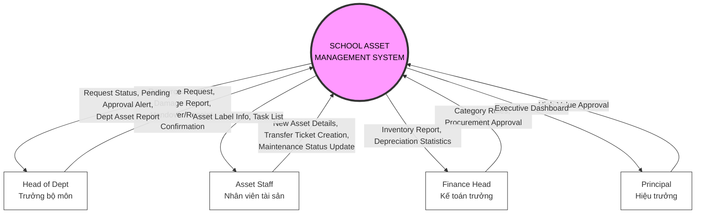

# AMS CONTEXT DIAGRAM DETAIL
**Project:** School Asset Management System (AMS)
**Version:** 2.0 (Finalized Scope)

---

## 1. Visual Context Diagram
Below is the Context Diagram for the AMS based on the finalized scope description.

---

## 2. External Entity Interactions

### 1. Head of Department (Trưởng bộ môn)
*   **Input (-> System):**
    *   `Resource Request`: Request for supplies or equipment for the department.
    *   `Damage Report`: Reporting broken items in department rooms.
    *   `Handover Confirmation`: Confirming assets leaving their department.
    *   `Receipt Confirmation`: Confirming assets arriving at their department.
*   **Output (System ->):**
    *   `Request Status`: Notification of approval or rejection.
    *   `Pending Approval Alert`: Notification of transfers requiring attention.
    *   `Dept Asset Report`: Inventory list of their specific department.

### 2. Asset Staff (Nhân viên tài sản)
*   **Input (-> System):**
    *   `New Asset Details`: Registering new procurements (Name, Price, Model).
    *   `Transfer Ticket Creation`: Initiating movement of assets.
    *   `Maintenance Status Update`: Log repair progress.
*   **Output (System ->):**
    *   `Asset Label Info`: Data for printing physical tags/stickers.
    *   `Task List`: Daily to-do list (Items to repair, Items to move).

### 3. Finance Head (Kế toán trưởng)
*   **Input (-> System):**
    *   `Category Rules`: Defining asset categories and depreciation rates.
    *   `Procurement Approval`: Budgetary approval for purchasing plans.
*   **Output (System ->):**
    *   `Inventory Report`: Full school asset audit.
    *   `Depreciation Statistics`: Financial value of assets over time.

### 4. Principal (Hiệu trưởng)
*   **Input (-> System):**
    *   `High-Value Approval`: Final sign-off for expensive items or liquidation.
*   **Output (System ->):**
    *   `Executive Dashboard`: High-level charts (Budget used, Total Asset Value).

---

## 3. Boundary Definition (Out of Scope)
To clarify the system boundaries, the following are explicitly **NOT** handled by AMS:
1.  **Vendor Management:** No direct ordering integration with suppliers.
2.  **Accounting Integration:** No API connection to external accounting software.
3.  **Teacher Access:** Teachers do not log in directly; they report needs through their HOD.
4.  **Hardware Scanning:** No direct barcode scanner device integration (manual input only).
